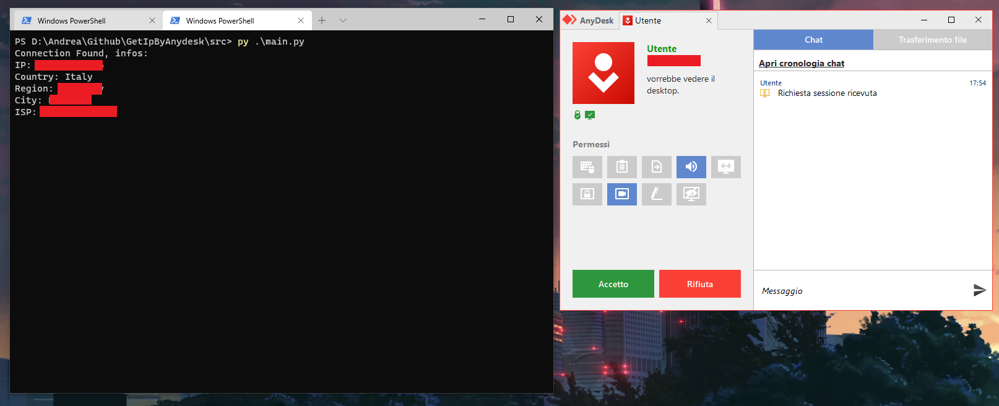

# Get IP By Anydesk

**Get the IP address of anyone trying to connect to your monitor via AnyDesk (currently supports Microsoft Windows only).**

This tool can be run before starting AnyDesk and will automatically detect and log the IPs of incoming connections.

> **Disclaimer:** This tool is intended for personal use only. It is not intended to track or monitor any individual without their consent. Please ensure you are in compliance with local laws and regulations regarding privacy and data protection before using this tool. Unauthorized tracking or logging of IP addresses may violate privacy laws.

[](https://sonarcloud.io/summary/new_code?id=LightYagami28_GetIpByAnydesk)

## Installation Guide (Git Required)

Follow these steps to set up the project:

1. Clone the repository:

   ```bash
   git clone https://github.com/LightYagami28/GetIpByAnydesk
   ```

2. Navigate to the project directory:

   ```bash
   cd GetIpByAnydesk
   ```

3. Install the required dependencies:

   ```bash
   py -m pip install -r requirements.txt
   ```

4. Go to the `src` folder:

   ```bash
   cd src
   ```

5. Run the application:

   ```bash
   py main.py
   ```

## Features

- ✅ **Automatic monitoring**: The program will continuously check for incoming AnyDesk connections.
- ✅ **IP Address Collection**: Once a connection attempt is detected, the program automatically retrieves the IP address of the client.
- ✅ **Detailed IP Information**: Fetches additional information about the IP address, including country, region, city, and ISP.
- ❌ **Linux Compatibility**: Currently, the program is only compatible with Microsoft Windows. (Support for Linux is planned for future updates.)

## Example Screenshot

Below is an example of the output when a connection is detected:



## Legal Disclaimer

By using this tool, you acknowledge and agree to the following:

- **Privacy Compliance**: Ensure that the usage of this tool complies with applicable privacy laws and regulations in your jurisdiction.
- **No Unauthorized Use**: Do not use this tool to track or monitor individuals without their explicit consent. The tool is meant for personal use to detect connections to your own device.
- **Logging of IP Addresses**: The program logs IP addresses of AnyDesk connection attempts. This data is not shared with third parties and is stored locally on your device.

If you are unsure about the legality of tracking IP addresses in your location, it is your responsibility to consult with a legal professional before using this tool.

## Contributing

If you'd like to contribute to this project, feel free to fork the repository, create a branch, and submit a pull request with your changes.

## License

This project is licensed under the MIT License - see the [LICENSE](LICENSE) file for details.
